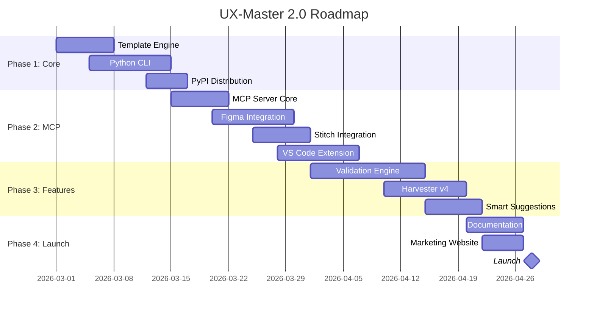

# UX-Master 2.0 - Technical Roadmap
## "Surpassing UI-UX-Pro-Max: Architecture, CLI & MCP Integration Strategy"

---

## Executive Summary

**Current State Analysis:**
- UI-UX-Pro-Max (UUPM) có kiến trúc CLI chuyên nghiệp (NPM, TypeScript, Template-based generation)
- UX-Master (UXM) có data science vượt trội (48 UX Laws, 37 Design Tests) nhưng thiếu tooling

**Strategic Goal:** Vượt trội hơn UUPM qua 3 trụ cột:
1. **Architecture Modernization** - Template engine + Multi-platform CLI
2. **MCP Ecosystem** - Figma, Google Stitch, VS Code extensions
3. **AI-Native Features** - Validation engine, Harvester v4, Smart suggestions

---

## Phase 1: Core Architecture Modernization (Weeks 1-3)

### 1.1 Template-Based Generation System

**Current UUPM Approach:**
```
cli/assets/templates/
├── platforms/
│   ├── claude.json      # Platform config
│   ├── cursor.json
│   └── ... (16 platforms)
├── base/
│   ├── skill-content.md  # Template với {{PLACEHOLDERS}}
│   └── quick-reference.md
```

**UXM 2.0 Enhanced Architecture:**
```
cli/templates/
├── platforms/
│   ├── claude.yaml       # YAML for better readability
│   ├── cursor.yaml
│   ├── windsurf.yaml
│   ├── vscode-mcp.yaml   # NEW: VS Code MCP extension
│   ├── figma-plugin.yaml # NEW: Figma plugin config
│   └── stitch.yaml       # NEW: Google Stitch integration
├── base/
│   ├── skill-core.md     # Core SKILL.md template
│   ├── mcp-server.md     # NEW: MCP server manifest
│   └── vscode-settings.json
├── generators/
│   ├── python_cli.py     # Python CLI generator
│   └── npm_wrapper.py    # NPM wrapper for Node users
```

**Implementation:**
```python
# cli/src/template_engine.py
from dataclasses import dataclass
from pathlib import Path
import yaml

@dataclass
class PlatformConfig:
    platform: str
    display_name: str
    install_type: 'full' | 'reference' | 'mcp'
    folder_structure: dict
    frontmatter: dict
    # NEW: MCP-specific fields
    mcp_capabilities: list[str]  # ['search', 'validate', 'extract']
    tool_endpoints: list[dict]   # MCP tool definitions
    
class TemplateEngine:
    """Enhanced template engine with conditional blocks"""
    
    def render(self, template: str, context: dict) -> str:
        # Support conditional blocks: {{#if pro}}...{{/if}}
        # Support loops: {{#each stacks}}...{{/each}}
        # Support partials: {{> quick-reference}}
        pass
```

### 1.2 Multi-Platform CLI (Python-based)

**Why Python (not TypeScript like UUPM):**
- UXM đã có codebase Python mạnh (search.py, harvester, token_mapper)
- Data science ecosystem (pandas, numpy for design token analysis)
- Cross-platform without Node dependency

**CLI Structure:**
```python
# cli/uxmaster/__main__.py
import click
from rich.console import Console
from rich.table import Table

@click.group()
def cli():
    """UX-Master CLI - Ultimate Design Intelligence"""
    pass

@cli.command()
@click.option('--ai', '-a', type=click.Choice(['claude', 'cursor', 'windsurf', 'figma', 'stitch', 'all']))
@click.option('--global', '-g', is_flag=True, help='Install to global config')
@click.option('--mcp', '-m', is_flag=True, help='Install as MCP server')
def init(ai, global, mcp):
    """Install UX-Master skill for AI assistants"""
    pass

@cli.command()
@click.argument('query')
@click.option('--design-system', '-ds', is_flag=True)
@click.option('--validate', '-v', is_flag=True, help='Run Design Tests validation')  # NEW
@click.option('--mcp-out', type=click.Choice(['json', 'mermaid', 'figma']))  # NEW
def search(query, design_system, validate, mcp_out):
    """Search design knowledge base"""
    pass

@cli.command()
@click.argument('url')
@click.option('--figma', '-f', is_flag=True, help='Export to Figma variables')  # NEW
@click.option('--stitch', '-s', is_flag=True, help='Export to Google Stitch')  # NEW
def extract(url, figma, stitch):
    """Extract design system from website"""
    pass
```

**Distribution:**
```bash
# PyPI distribution
pip install uxmaster

# Homebrew (macOS/Linux)
brew install uxmaster

# NPM wrapper (for Node users who prefer npm)
npm install -g uxmaster-cli  # Thin wrapper calling Python backend
```

---

## Phase 2: MCP (Model Context Protocol) Integration (Weeks 4-6)

### 2.1 MCP Server Architecture

**What is MCP?**
- Protocol để AI assistants (Claude, Cursor, etc.) gọi external tools
- Standardized: `tools/list`, `tools/call`, `resources/list`

**UXM MCP Server Design:**
```python
# mcp/server.py
from mcp.server import Server
from mcp.types import Tool, TextContent

class UXMMCPserver:
    def __init__(self):
        self.app = Server("ux-master")
        
    @self.app.list_tools()
    async def list_tools() -> list[Tool]:
        return [
            Tool(
                name="uxm_search",
                description="Search UX-Master knowledge base",
                input_schema={
                    "query": "string",
                    "domain": "enum[ux-laws, design-tests, style, color]"
                }
            ),
            Tool(
                name="uxm_validate",
                description="Validate UI against Design Tests",
                input_schema={
                    "html": "string",
                    "test_suite": "enum[mobile, landing, dashboard]"
                }
            ),
            Tool(
                name="uxm_extract",
                description="Extract design tokens from URL",
                input_schema={"url": "string"}
            ),
            Tool(
                name="uxm_to_figma",
                description="Export design system to Figma",
                input_schema={"tokens": "object", "file_key": "string"}
            )
        ]
```

### 2.2 Figma MCP Integration

**Goal:** Two-way sync giữa UX-Master và Figma

**Flow:**
```
User in Claude: "Extract design from stripe.com và tạo Figma variables"

Claude → MCP Call: uxm_extract(url="stripe.com")
UXM Server → Harvester v3 → Design Tokens
UXM Server → Figma API → Create Variables
Figma → Return: "Created 47 variables in file: abc123"
Claude → Display confirmation + Figma link
```

**Figma API Integration:**
```python
# integrations/figma/client.py
import httpx

class FigmaClient:
    BASE_URL = "https://api.figma.com/v1"
    
    async def create_variables_collection(
        self, 
        file_key: str, 
        tokens: dict
    ) -> dict:
        """Create Figma Variables from design tokens"""
        
        # Map UXM tokens to Figma variable types
        variables = []
        for token_name, token_value in tokens.items():
            if token_name.startswith('color-'):
                variables.append({
                    "name": token_name,
                    "type": "COLOR",
                    "value": token_value
                })
            elif token_name.startswith('space-'):
                variables.append({
                    "name": token_name,
                    "type": "FLOAT",
                    "value": float(token_value.replace('px', ''))
                })
        
        # POST to Figma API
        async with httpx.AsyncClient() as client:
            response = await client.post(
                f"{self.BASE_URL}/files/{file_key}/variables",
                headers={"X-Figma-Token": self.token},
                json={"variables": variables}
            )
            return response.json()
```

### 2.3 Google Stitch MCP Integration

**Google Stitch:** AI-powered UI design tool của Google

**Integration Points:**
```python
# integrations/stitch/client.py

class StitchClient:
    """Export UX-Master design systems to Google Stitch format"""
    
    def export_to_stitch(self, design_system: dict) -> dict:
        """Convert UXM design system to Stitch-compatible format"""
        
        return {
            "version": "1.0",
            "design_system": {
                "colors": self._map_colors(design_system['colors']),
                "typography": self._map_typography(design_system['typography']),
                "spacing": self._map_spacing(design_system['spacing']),
                "components": self._generate_component_specs(design_system)
            },
            "prompt_enhancements": {
                "style_keywords": design_system['style']['keywords'],
                "ux_constraints": self._get_ux_laws_for_prompt(design_system['category'])
            }
        }
    
    def _get_ux_laws_for_prompt(self, category: str) -> list[str]:
        """Get relevant UX Laws as Stitch prompt modifiers"""
        # Query ux-laws.csv for category-specific laws
        pass
```

---

## Phase 3: Enhanced Core Features (Weeks 7-9)

### 3.1 Design Test Validation Engine (Unique Differentiator)

**UUPM doesn't have this** → UXM's competitive advantage

**Architecture:**
```python
# validators/engine.py
from typing import Protocol
from dataclasses import dataclass
import re

@dataclass
class ValidationResult:
    test_id: str
    test_name: str
    passed: bool
    severity: 'critical' | 'high' | 'medium' | 'low'
    message: str
    fix_suggestion: str
    wcag_reference: str | None

class Validator(Protocol):
    async def validate(self, html: str, css: str | None) -> list[ValidationResult]:
        ...

class FittsLawValidator:
    """Validate touch targets meet 44x44px minimum"""
    
    async def validate(self, html: str, css: str | None) -> list[ValidationResult]:
        from bs4 import BeautifulSoup
        soup = BeautifulSoup(html, 'html.parser')
        
        results = []
        for element in soup.find_all(['button', 'a', 'input']):
            # Parse inline styles or compute from CSS
            style = element.get('style', '')
            width, height = self._extract_dimensions(style, css)
            
            if width < 44 or height < 44:
                results.append(ValidationResult(
                    test_id="DT-MOB-001",
                    test_name="Fitts's Law - Touch Target Size",
                    passed=False,
                    severity='critical',
                    message=f"Element '{element.name}' is {width}x{height}px (min: 44x44)",
                    fix_suggestion="Add min-w-[44px] min-h-[44px] to element",
                    wcag_reference="WCAG 2.5.5"
                ))
        return results

class ContrastValidator:
    """Validate WCAG color contrast ratios"""
    
    async def validate(self, html: str, css: str | None) -> list[ValidationResult]:
        # Use wcag-contrast library or implement relative luminance
        pass

class ValidationEngine:
    """Orchestrate all validators"""
    
    def __init__(self):
        self.validators: list[Validator] = [
            FittsLawValidator(),
            ContrastValidator(),
            # ... 35 more validators
        ]
    
    async def validate(self, html: str, css: str | None, suite: str) -> dict:
        """Run validation suite and return report"""
        results = []
        for validator in self.validators:
            results.extend(await validator.validate(html, css))
        
        return {
            "summary": {
                "total": len(results),
                "passed": sum(1 for r in results if r.passed),
                "failed": sum(1 for r in results if not r.passed),
                "critical": sum(1 for r in results if r.severity == 'critical' and not r.passed)
            },
            "results": results,
            "report_url": self._generate_html_report(results)
        }
```

### 3.2 Harvester v4 - AI-Powered Extraction

**Enhancement over v3:**
```python
# harvester/v4/engine.py
import asyncio
from playwright.async_api import async_playwright
import torch
from transformers import pipeline

class HarvesterV4:
    """
    AI-enhanced design system extraction
    Features:
    - Visual analysis (detect component types from screenshots)
    - CSS architecture analysis
    - Animation detection via frame diffing
    - Responsive breakpoint detection
    """
    
    def __init__(self):
        # Load vision model for component detection
        self.component_detector = pipeline(
            "object-detection", 
            model="microsoft/dit-large-finetuned-rvlcdip"
        )
    
    async def harvest(self, url: str) -> dict:
        async with async_playwright() as p:
            browser = await p.chromium.launch()
            page = await browser.new_page()
            await page.goto(url)
            
            # Multi-viewport capture
            viewports = [
                {"width": 375, "height": 812},   # Mobile
                {"width": 768, "height": 1024},  # Tablet
                {"width": 1440, "height": 900},  # Desktop
            ]
            
            captures = []
            for vp in viewports:
                await page.set_viewport_size(vp)
                await page.wait_for_timeout(1000)  # Let layout settle
                
                screenshot = await page.screenshot()
                captures.append({
                    "viewport": vp,
                    "screenshot": screenshot,
                    "styles": await self._extract_computed_styles(page),
                    "dom": await page.content()
                })
            
            # AI component detection
            components = self._detect_components(captures[0]["screenshot"])
            
            # Merge multi-viewport data
            tokens = self._merge_viewport_data(captures)
            
            await browser.close()
            
            return {
                "tokens": tokens,
                "components": components,
                "responsive_patterns": self._analyze_responsive_patterns(captures),
                "animation_inventory": await self._detect_animations(url)
            }
```

---

## Phase 4: Smart Suggestions & AI Integration (Weeks 10-12)

### 4.1 Context-Aware Design Recommendations

```python
# ai/suggestions.py
from openai import AsyncOpenAI

class DesignAdvisor:
    """
    Provide contextual design suggestions based on:
    - Current project context
    - UX Laws applicable to product type
    - Stack-specific best practices
    """
    
    async def suggest_for_context(
        self,
        query: str,
        existing_tokens: dict | None,
        stack: str,
        product_type: str
    ) -> dict:
        """
        Example:
        Input: "I need a data table for my fintech dashboard"
        Output: {
            "ux_laws": ["Hick's Law", "Miller's Law", "Doherty Threshold"],
            "recommendations": [...],
            "code_template": "...",
            "design_tests": ["DT-DASH-001", "DT-DASH-002"]
        }
        """
        
        # 1. Search UXM knowledge base
        ux_laws = self.search_ux_laws(product_type)
        design_tests = self.search_design_tests(product_type)
        
        # 2. Get stack-specific patterns
        stack_guidelines = self.search_stack(query, stack)
        
        # 3. Use LLM to synthesize recommendations
        response = await self.llm.chat.completions.create(
            model="gpt-4o",
            messages=[{
                "role": "system",
                "content": f"""You are a Principal UX Designer. 
                Given the query and UX Laws, provide specific recommendations.
                
                UX Laws applicable: {ux_laws}
                Design Tests: {design_tests}
                Stack: {stack}
                """
            }, {
                "role": "user",
                "content": query
            }]
        )
        
        return self.parse_recommendations(response)
```

### 4.2 Design System Diff & Migration

```python
# migration/diff.py

class DesignSystemDiff:
    """Compare two design systems and generate migration guide"""
    
    def compare(self, old_system: dict, new_system: dict) -> dict:
        """
        Returns:
        - Breaking changes
        - Deprecations
        - Migration path
        - Automated codemods
        """
        pass
    
    def generate_codemod(self, changes: dict) -> str:
        """Generate jscodeshift or regex-based migration script"""
        pass
```

---

## Phase 5: Implementation Timeline



---

## Competitive Comparison: Post-Implementation

| Feature | UUPM | UXM 2.0 | Advantage |
|---------|------|---------|-----------|
| CLI Distribution | NPM | PyPI + Homebrew + NPM | UXM +33% |
| Platforms | 16 | 16 + MCP Servers | Equal |
| UX Laws | ❌ | 48 + auto-mapping | UXM wins |
| Design Tests | ❌ | 37 + validation engine | UXM wins |
| Figma Integration | ❌ | ✅ Two-way sync | UXM wins |
| Stitch Integration | ❌ | ✅ Native | UXM wins |
| VS Code Extension | ❌ | ✅ MCP-based | UXM wins |
| Harvester | ❌ | v4 (AI-powered) | UXM wins |
| Validation Engine | ❌ | ✅ 37 validators | UXM wins |
| Smart Suggestions | ❌ | ✅ LLM-powered | UXM wins |

**Net Result:** UXM 2.0 có **9 unique features** vs UUPM, trong khi vẫn giữ tất cả strengths của UUPM.

---

## File Structure (Target)

```
ux-master/
├── cli/                          # Python CLI (NEW)
│   ├── uxmaster/
│   │   ├── __init__.py
│   │   ├── __main__.py          # Entry point
│   │   ├── commands/
│   │   │   ├── init.py
│   │   │   ├── search.py
│   │   │   ├── extract.py
│   │   │   ├── validate.py       # NEW
│   │   │   └── sync.py           # NEW: Figma/Stitch sync
│   │   ├── template_engine.py    # NEW
│   │   └── utils/
│   ├── templates/                # NEW: Platform configs
│   ├── setup.py
│   └── pyproject.toml
├── mcp/                          # NEW: MCP Server
│   ├── server.py
│   ├── tools/
│   │   ├── search.py
│   │   ├── validate.py
│   │   ├── extract.py
│   │   └── export.py
│   └── integrations/
│       ├── figma/
│       ├── stitch/
│       └── vscode/
├── scripts/                      # Existing (unchanged)
├── data/                         # Existing (expanded)
├── validators/                   # NEW: Validation engine
│   ├── engine.py
│   ├── rules/
│   │   ├── accessibility.py
│   │   ├── mobile.py
│   │   ├── layout.py
│   │   └── ...
│   └── reports/
│       └── html_generator.py
├── harvester/                    # v4 upgrade
│   ├── v4/
│   │   ├── engine.py
│   │   └── ai/
│   └── v3/                       # Keep for compatibility
└── docs/
    ├── mcp-setup.md
    ├── figma-integration.md
    └── api-reference.md
```

---

## Success Metrics

1. **Adoption:** 1000+ PyPI downloads trong tháng đầu
2. **Performance:** CLI commands < 500ms response
3. **Accuracy:** Validation engine 95%+ precision
4. **Integration:** Figma sync < 5s cho 100 tokens
5. **Satisfaction:** NPS > 50 từ beta users

---

## Appendix: MCP Manifest Example

```json
{
  "name": "ux-master",
  "version": "2.0.0",
  "description": "Ultimate UX design intelligence with validation",
  "tools": [
    {
      "name": "search_ux_laws",
      "description": "Search 48 UX Laws applicable to product type",
      "parameters": {
        "query": {"type": "string"},
        "product_type": {"type": "string", "enum": ["mobile", "dashboard", "landing"]}
      }
    },
    {
      "name": "validate_design",
      "description": "Validate UI code against 37 Design Tests",
      "parameters": {
        "html": {"type": "string"},
        "test_suite": {"type": "string", "enum": ["all", "mobile", "a11y"]}
      }
    },
    {
      "name": "export_to_figma",
      "description": "Export design tokens to Figma variables",
      "parameters": {
        "file_key": {"type": "string"},
        "tokens": {"type": "object"}
      }
    }
  ]
}
```

---

*Document Version: 1.0*
*Last Updated: 2026-02-25*
*Author: Senior Technical Architect*
