# PLAN: Semi-Sync Harvester Protocol — USP Upgrade

Nâng cấp MasterDesign Agent skill thành **Agentic Design System Compiler** — reverse-engineer visual identity từ live web app (SaaS có auth) → biên dịch thành Semi Design ecosystem.

---

## Current State

| File | Role |
|------|------|
| `scripts/core.py` | BM25 search engine, CSV loader |
| `scripts/design_system.py` | Design system generator |
| `scripts/search.py` | CLI entry point |
| `data/*.csv` | 838+ entries, 13 domains |

**Gap:** Không có browser-based extraction, không Semi Design token mapping, không MCP React generation.

---

## Architecture

```mermaid
graph TB
    subgraph "Phase 1: Harvester Engine"
        A["🌐 Browser Tool"] -->|Navigate| B["Target App"]
        B -->|"⏳ PAUSE"| C["👨‍💻 Human Auth"]
        C -->|"READY"| D["💉 harvester.js"]
        D -->|"getComputedStyle()"| E["Raw JSON"]
    end

    subgraph "Phase 2: Token Compiler"
        E -->|"token_mapper.py"| F["Semi Token Map"]
        F --> G["📄 semi-theme-override.css"]
        F --> H["🎨 figma-tokens.json"]
    end

    subgraph "Phase 3: MCP Code Gen"
        F -->|"Semi MCP Query"| I["💻 React Component"]
    end

    style A fill:#1e40af,color:#fff
    style C fill:#f59e0b,color:#000
    style G fill:#10b981,color:#fff
    style H fill:#8b5cf6,color:#fff
    style I fill:#ef4444,color:#fff
```



---

## Phased Delivery (TDD Workflow)

### Phase 1: CSSOM Harvester Engine

> **Goal:** Extract visual DNA from any rendered web page

#### [NEW] [harvester.js](file:///Users/todyle/Library/Mobile Documents/com~apple~CloudDocs/Code/AgentSkills/ux-master/scripts/harvester.js)

IIFE script injected via browser console. Scans semantic DOM elements:

| Category | Elements Scanned | Properties Extracted |
|----------|-----------------|---------------------|
| **Brand Colors** | `[class*=primary]`, `[type=submit]`, `.btn-*` | `backgroundColor`, `color` |
| **Semantic Colors** | `.success`, `.warning`, `.danger`, `.error`, alert banners | `backgroundColor`, `borderColor` |
| **Surfaces** | `body`, `.card`, `.panel`, `main`, sidebar | `backgroundColor`, `borderColor` |
| **Typography** | `h1-h6`, `body`, `p`, `label` | `fontFamily`, `fontSize`, `lineHeight`, `fontWeight`, `color` |
| **Geometry** | buttons, cards, modals, inputs | `borderRadius`, `boxShadow`, `padding` |

**Output:** `JSON.stringify()` → raw token object

**TDD Cycle:**

```
🔴 RED:   test_harvester.py — mock DOM fixtures → assert JSON structure
🟢 GREEN: harvester.js — minimal extraction logic
🔵 REFACTOR: robustness (fallbacks, de-duplication, color normalization)
```

---

### Phase 2: Semi Token Compiler

> **Goal:** Map raw values → Semi Design `--semi-*` variables → multi-format output

#### [NEW] [token_mapper.py](file:///Users/todyle/Library/Mobile Documents/com~apple~CloudDocs/Code/AgentSkills/ux-master/scripts/token_mapper.py)

**Core functions:**

| Function | Input | Output |
|----------|-------|--------|
| `map_to_semi_tokens(raw)` | Raw JSON | `--semi-*` dict |
| `derive_shades(hex, steps)` | Base color | `-hover`, `-active` variants |
| `generate_css_override(tokens)` | Token dict | CSS `:root {}` block |
| `generate_figma_tokens(tokens)` | Token dict | Tokens Studio JSON |
| `generate_summary(tokens)` | Token dict | Markdown report |

**Semi Token Mapping (subset):**

| Extracted → | Semi Variable |
|---|---|
| Primary btn bg | `--semi-color-primary` |
| Primary hover (darken 10%) | `--semi-color-primary-hover` |
| Primary active (darken 20%) | `--semi-color-primary-active` |
| Success green | `--semi-color-success` |
| Warning orange | `--semi-color-warning` |
| Danger red | `--semi-color-danger` |
| App background | `--semi-color-bg-0` |
| Card surface | `--semi-color-bg-1` |
| Elevated surface | `--semi-color-bg-2` |
| Title text | `--semi-color-text-0` |
| Body text | `--semi-color-text-1` |
| Muted text | `--semi-color-text-2` |
| Border color | `--semi-color-border` |
| Button radius | `--semi-border-radius-medium` |
| Card shadow | `--semi-shadow-elevated` |
| Font family | `--semi-font-family-regular` |

#### [NEW] [semi-tokens.csv](file:///Users/todyle/Library/Mobile Documents/com~apple~CloudDocs/Code/AgentSkills/ux-master/data/semi-tokens.csv)

Reference database — all Semi CSS variables, defaults, categories. Used for BM25 search and validation.

**TDD Cycle:**

```
🔴 RED:   test_token_mapper.py
          - test_map_primary_color → assert --semi-color-primary
          - test_derive_hover_shade → assert darkened hex
          - test_generate_css → assert valid CSS block
          - test_generate_figma_json → assert JSON schema
          - test_missing_values → assert graceful defaults
🟢 GREEN: token_mapper.py — implement each function
🔵 REFACTOR: color math, edge cases, multi-theme support
```

---

### Phase 3: SKILL.md + Workflow Protocol

> **Goal:** Document `/harvest` command in SKILL.md

#### [MODIFY] [SKILL.md](file:///Users/todyle/Library/Mobile Documents/com~apple~CloudDocs/Code/AgentSkills/ux-master/SKILL.md)

Add new section **"Step 8: Live App Harvester — Semi-Sync Protocol"**:

```markdown
### `/harvest <URL>` Workflow
1. AI opens browser → navigates to URL
2. PAUSE → "⏳ Please authenticate. Type READY"
3. Inject harvester.js → extract CSSOM
4. Run token_mapper.py → map to Semi tokens
5. Output: CSS Override + Figma Tokens + (optional) React component
```

**TDD Cycle:**

```
🔴 RED:   test_skill_docs.py — assert SKILL.md contains /harvest section
🟢 GREEN: Add section to SKILL.md
🔵 REFACTOR: formatting, cross-references
```

---

### Phase 4: Semi MCP Integration (Future Session)

> **Goal:** AI queries Semi MCP → generates production React components

#### [NEW] [semi_mcp_bridge.py](file:///Users/todyle/Library/Mobile Documents/com~apple~CloudDocs/Code/AgentSkills/ux-master/scripts/semi_mcp_bridge.py)

Bridge for AI to programmatically call Semi MCP tools:

| MCP Tool | Purpose |
|----------|---------|
| `get_semi_document` | Component docs (Button, Table, Layout) |
| `get_semi_code_block` | Code examples |
| `get_component_file_list` | Source file list |
| `get_file_code` | Read source code |
| `get_function_code` | Read specific function |

> [!NOTE]
> `@douyinfe/semi-mcp` installed at `/tmp/semi-mcp-ref` for reference only. End users don't need to install — AI IDE's MCP config handles it. MCP setup: `npx -y @douyinfe/semi-mcp`

---

## File Summary

| Phase | File | Action |
|-------|------|--------|
| 1 | `scripts/harvester.js` | NEW |
| 1 | `tests/test_harvester.py` | NEW |
| 2 | `scripts/token_mapper.py` | NEW |
| 2 | `data/semi-tokens.csv` | NEW |
| 2 | `tests/test_token_mapper.py` | NEW |
| 3 | `SKILL.md` | MODIFY |
| 4 | `scripts/semi_mcp_bridge.py` | NEW (future) |

---

## Verification Plan

### Automated Tests (Per Phase)

```bash
# Phase 1: Harvester JS syntax check
node -c scripts/harvester.js

# Phase 2: Token mapper unit tests
python3 -m pytest tests/test_token_mapper.py -v

# Phase 3: SKILL.md content validation
grep -q "/harvest" SKILL.md && echo "PASS" || echo "FAIL"
```

### Browser Integration Test (Phase 1+2 combined)

1. AI mở browser tới `https://semi.design` (public, không cần auth)
2. Inject `harvester.js` → kiểm tra JSON output hợp lệ
3. Feed JSON vào `token_mapper.py` → verify CSS + JSON output
4. Kiểm tra CSS file có đúng Semi `--semi-*` format

### End-to-End Test (Phase 3 — with user)

1. User trigger `/harvest` trên một SaaS app thực tế
2. User login thủ công → type READY
3. AI extract → output CSS + Figma JSON
4. User verify visual match giữa output và target app

---

## Decisions Confirmed

| Question | Decision |
|----------|----------|
| Browser tool | Sử dụng built-in browser_subagent của AI IDE |
| Semi MCP | Cài để tham khảo source code, end user không cần cài |
| Delivery | Phased: Phase 1→2→3 ship từng session, TDD cycle per phase |
